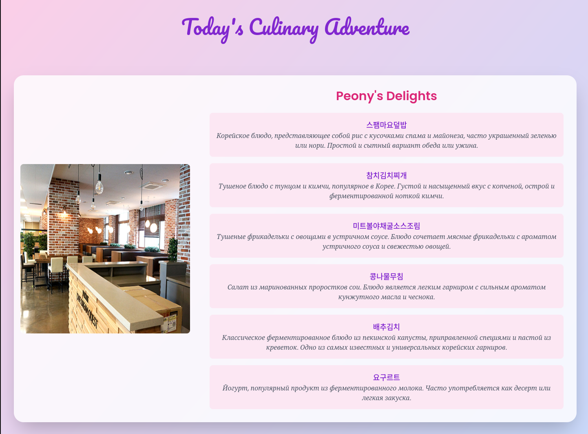

# Daily Menu Tracker

**Daily Menu Tracker** is a lightweight web application that provides up-to-date cafeteria menus for university, helping students quickly see what’s on the menu each day.

## Features

- **Dayly Menu Updates**: Automatically fetches and displays daily cafeteria menus every day.

## Technologies Used

- **Backend**: Written in **Go**.
- **Frontend**: Designed with **Tailwind CSS**.
- **HTML Templates**: Utilized for rendering dynamic content.

## Folder Structure

- `api/` - Handlers for serving API routes.
- `cmd/` - Entry point for the application.
- `config/` - Configuration files for the application.
- `data/` - Data models and repositories.
- `internal/` - Core business logic.
- `public/` - Static assets (e.g., CSS, JavaScript).
- `templates/` - HTML templates for dynamic rendering.
- `tests/` - Unit and integration tests.
