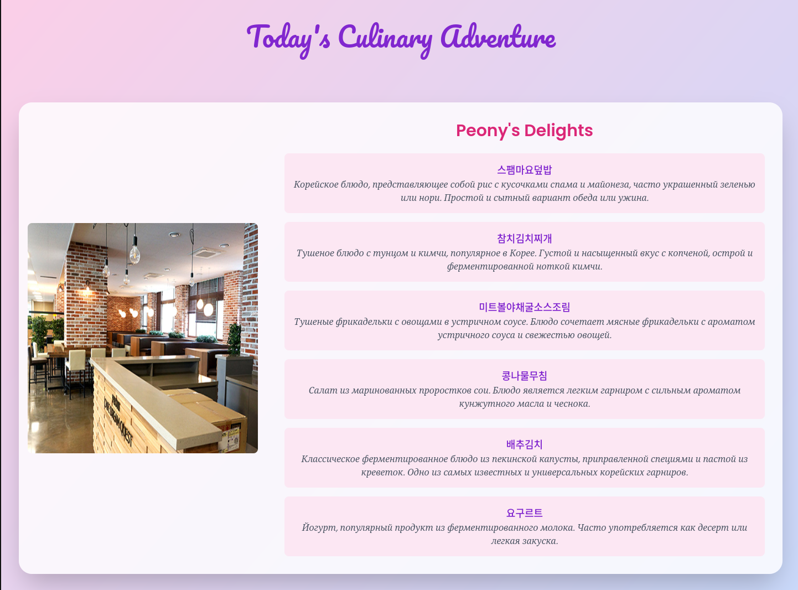

# Daily Menu Tracker

**Daily Menu Tracker** is a lightweight web application that provides up-to-date cafeteria menus for university, helping students quickly see what’s on the menu each day.

## Features

- **Dayly Menu Updates**: Automatically fetches and displays daily cafeteria menus every day.

## Technologies Used

- **Backend**: Written in **Go**.
- **Frontend**: Designed with **Tailwind CSS**.
- **HTML Templates**: Utilized for rendering dynamic content.
