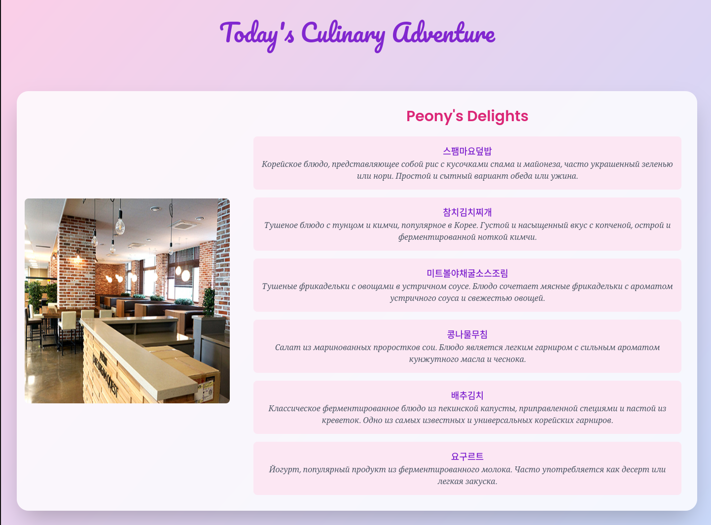

# Daily Menu Tracker



Daily Menu Tracker is a Go service that fetches cafeteria menus, normalizes them with the help of an AI assistant, persists the results, and exposes them through a web page and a Telegram bot. The application keeps students up to date with what is being served in the Peony and Azilea cafeterias every day.

## Highlights
- **Automated fetcher**: Scrapes the Peony and Azilea menu pages, validates them, and falls back gracefully if a cafeteria is closed.
- **AI enrichment**: Uses a GPT-compatible endpoint to validate extracted dishes and enrich them with descriptions.
- **Persistent storage**: Stores the normalized menu in SQLite and ships with migrations that run automatically on startup.
- **Telegram notifications**: Sends out a daily digest at 10:00 KST and allows users to subscribe/unsubscribe via inline buttons.

## Prerequisites
- Go 1.23+
- SQLite (automatically bundled when running via Docker; required locally for tooling support)
- A GPT-compatible endpoint and token that follow the `internal/ai` response schema
- Telegram bot token (create via [@BotFather](https://t.me/BotFather))

## Quick Start
1. Install dependencies listed in the prerequisites.
2. Create a `.env` file in the project root:

   ```dotenv
   PORT=8080
   DATABASE_PATH=./database/daily-menu.db
   MIGRATION_PATH=migrations
   PEONY_URL=https://example.com/peony
   AZILEA_URL=https://example.com/azilea
   TELEGRAM_BOT_TOKEN=000000000:example-token
   GPT_URL=https://ai.example.com/v1/chat
   GPT_TOKEN=example-secret
   ```

3. Start the application:

   ```bash
   go run cmd/main.go
   ```

4. Open http://localhost:8080 to view the latest menu. The Telegram bot and scheduler start automatically in the same process.

### Running with Docker Compose

```bash
docker compose up --build
```

The container exposes port `3030` by default and uses the `.env` file for configuration. Menu data is persisted in the named volume `daily-menu-data`.

## Scheduler & Bot
- Menus are refreshed on a cron-like schedule via `internal/menu/scheduler.go`.
- The Telegram bot sends a daily summary at **10:00 KST** and respects user subscriptions stored in SQLite.
- Subscribers can manage their status with inline buttons rendered by the bot (`🔔 Подписаться`, `❌ Отписаться`).

## HTTP Endpoints
- `GET /` – Landing page with the latest menu rendered via Go templates.
- `GET /up` – Health probe responding with `{"status":"ok"}` for liveness checks.
- Static assets are served from `/dist`, `/static`, and `/img`.

## Development Workflow
- Run locally: `go run cmd/main.go`
- Build binary: `go build -o tmp/main cmd/main.go`
- Tests (none yet): `go test ./...`
- Lint/format: `gofmt -d .` and `go vet ./...`

During development you can send yourself a preview through the Telegram bot by subscribing with `/start` and using the inline buttons in the chat.

## Project Structure

```
.
├── cmd/                # Application entrypoint
├── internal/
│   ├── ai/             # GPT client abstraction
│   ├── bot/            # Telegram bot and subscription repository
│   ├── config/         # Environment-backed configuration loader
│   ├── database/       # SQLite initialization and migrations
│   ├── http/           # Gin server, middlewares, handlers
│   └── menu/           # Menu parsing, validation, enrichment, scheduler
├── migrations/         # SQL migrations applied on startup
├── pkg/logger/         # Structured logging setup
├── templates/          # HTML templates for the web UI
└── web/                # Static assets served by the HTTP server
```

